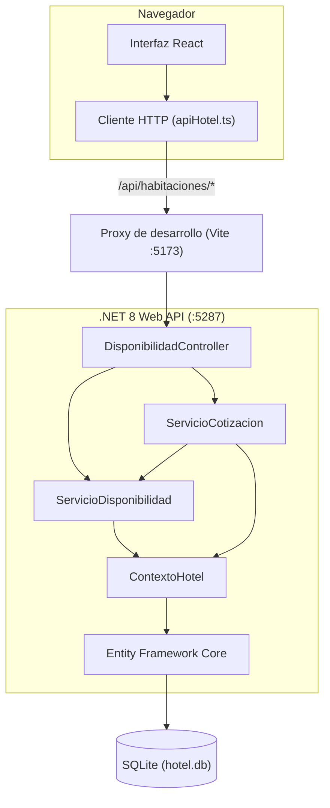

# Diagrama de componentes

```mermaid
flowchart TD
    subgraph Navegador["Navegador"]
        React["Interfaz React"]
        ClienteHTTP["Cliente HTTP (apiHotel.ts)"]
        React --> ClienteHTTP
    end

    ProxyVite["Proxy de desarrollo (Vite :5173)"]
    ClienteHTTP -->|"/api/habitaciones/*"| ProxyVite

    subgraph Backend[".NET 8 Web API (:5287)"]
        Controlador["DisponibilidadController"]
        ServicioDisp["ServicioDisponibilidad"]
        ServicioCot["ServicioCotizacion"]
        EFCore["Entity Framework Core"]
        Contexto["ContextoHotel"]

        Controlador --> ServicioDisp
        Controlador --> ServicioCot
        ServicioCot --> ServicioDisp
        ServicioDisp --> Contexto
        ServicioCot --> Contexto
        Contexto --> EFCore
    end

    ProxyVite --> Controlador
    EFCore --> BaseDatos[("SQLite (hotel.db)")]
```
