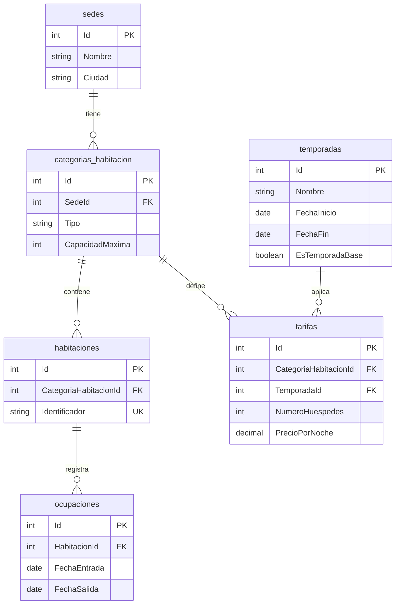

# Modelo de datos

```mermaid
erDiagram
    sedes ||--o{ categorias_habitacion : tiene
    categorias_habitacion ||--o{ habitaciones : contiene
    habitaciones ||--o{ ocupaciones : registra
    categorias_habitacion ||--o{ tarifas : define
    temporadas ||--o{ tarifas : aplica

    sedes {
        int Id PK
        string Nombre
        string Ciudad
    }

    categorias_habitacion {
        int Id PK
        int SedeId FK
        string Tipo
        int CapacidadMaxima
    }

    habitaciones {
        int Id PK
        int CategoriaHabitacionId FK
        string Identificador UK
    }

    ocupaciones {
        int Id PK
        int HabitacionId FK
        date FechaEntrada
        date FechaSalida
    }

    temporadas {
        int Id PK
        string Nombre
        date FechaInicio
        date FechaFin
        boolean EsTemporadaBase
    }

    tarifas {
        int Id PK
        int CategoriaHabitacionId FK
        int TemporadaId FK
        int NumeroHuespedes
        decimal PrecioPorNoche
    }
```
